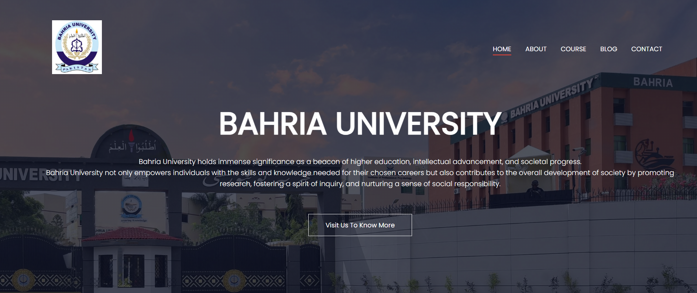
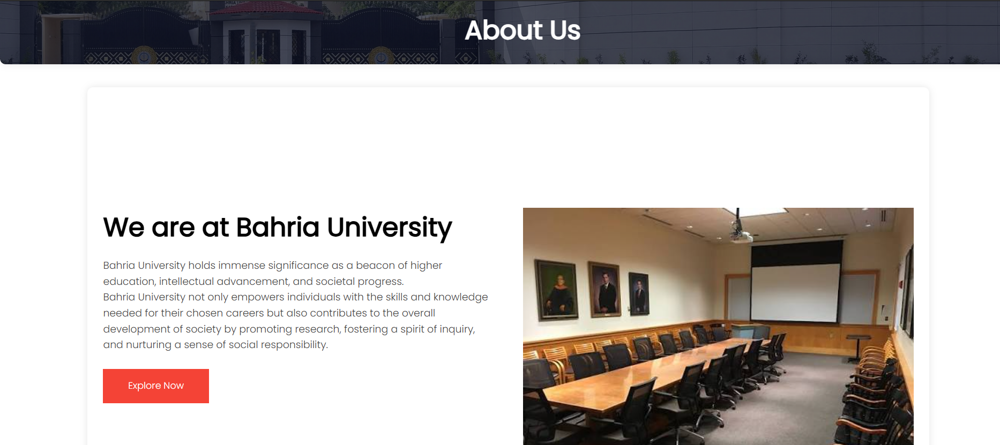
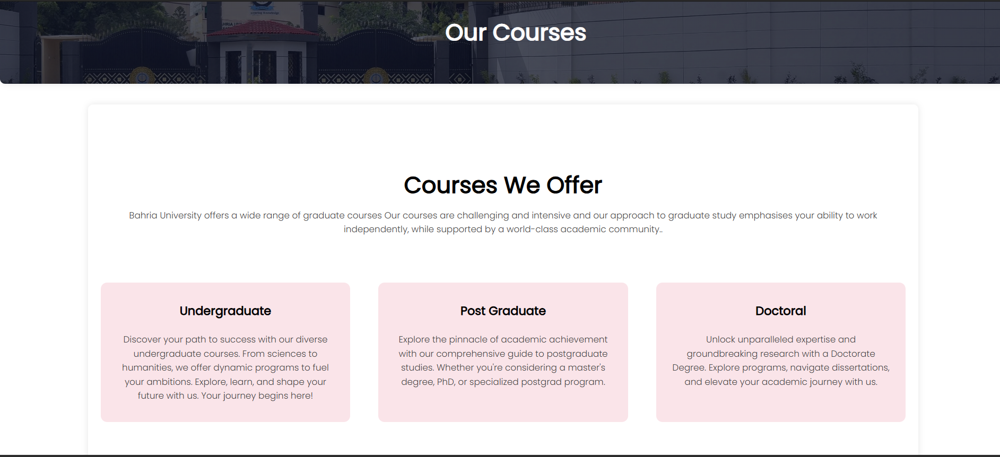
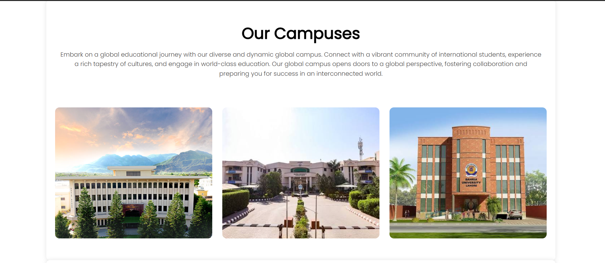
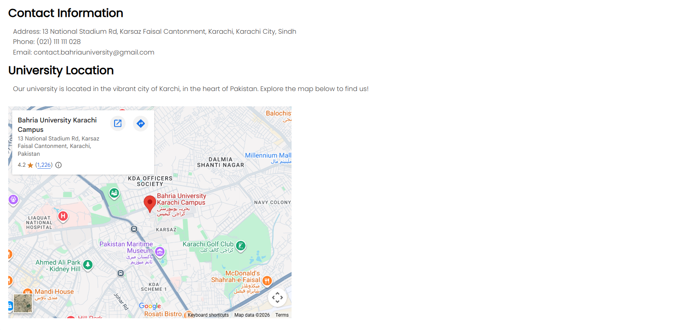

# Bahria University Website Clone

[](https://github.com/Realmaryambano/Bahria-University-Website-Clone/blob/main/LICENSE)
[](https://html.spec.whatwg.org/)
[](https://www.w3.org/Style/CSS/Overview.en.html)
[](https://www.javascript.com/)
[](https://github.com/Realmaryambano/Bahria-University-Website-Clone)

A responsive and modern multi-page university website clone built using **HTML5, CSS3, and JavaScript**. This project replicates the design and structure of an educational institution website, featuring university information, courses, campus details, facilities, blog content, testimonials, and a contact page.

The goal of this project was to practice **frontend development, responsive web design, UI structuring, and creating a complete website interface from scratch.**

**[📂 GitHub Repository](https://github.com/Realmaryambano/Bahria-University-Website-Clone)**

---

## 📋 Table of Contents

- [Website Preview](#-website-preview)
- [Features](#-features)
- [Project Structure](#-project-structure)
- [Pages Overview](#-pages-overview)
- [Technologies Used](#-technologies-used)
- [Installation & Setup](#-installation--setup)
- [Project Highlights](#-project-highlights)
- [Future Improvements](#-future-improvements)
- [Browser Compatibility](#-browser-compatibility)
- [License](#-license)
- [Contact](#-contact)

---

## 🌐 Website Preview

### Home Page


### About Section


### Courses Section


### Campus & Facilities


### Contact Page


---

# ✨ Features

- ✅ Fully responsive design for desktop, tablet, and mobile devices
- ✅ Modern university landing page layout
- ✅ Responsive navigation bar with mobile hamburger menu
- ✅ Hero section with call-to-action buttons
- ✅ Course and program showcase
- ✅ Campus information section
- ✅ Facilities and student experience section
- ✅ Student testimonials section
- ✅ Blog/news section
- ✅ Contact form interface
- ✅ Embedded Google Maps location
- ✅ Custom styling with CSS3
- ✅ Integrated Google Fonts and Font Awesome icons

---

# 📁 Project Structure

```
Bahria-University-Website-Clone/

│

├── index.html          # Homepage

├── about.html          # About university page

├── course.html         # Courses and programs page

├── blog.html           # Blog/news page

├── contact.html        # Contact page

├── style.css           # Main stylesheet

├── images/             # Website images and assets

├── README.md           # Project documentation

└── LICENSE             # MIT License

```

---

# 📄 Pages Overview

## 🏠 Home Page (index.html)

Includes:
- University hero section
- Introduction about Bahria University
- Course categories
- Campus showcase
- Facilities section
- Student testimonials
- Call-to-action section
- Footer with social links

## 🎓 About Page (about.html)

Contains:
- University introduction
- Mission and educational vision
- Information about academic development
- About section with images

## 📚 Courses Page (course.html)

Features:
- Undergraduate programs
- Postgraduate programs
- Doctoral programs
- Facilities overview

## 📰 Blog Page (blog.html)

Includes:
- University-related articles
- Online programs information
- Blog categories:
  - Business Analytics
  - Data Science
  - Machine Learning
  - Computer Science

## 📞 Contact Page (contact.html)

Contains:
- Contact form UI
- University contact information
- Google Maps integration
- Location details

---

# 🛠 Technologies Used

## Frontend Development

- **HTML5**
  - Semantic webpage structure
  - Multi-page website layout

- **CSS3**
  - Responsive design
  - Flexbox layouts
  - Animations and hover effects
  - Media queries

- **JavaScript**
  - Responsive navigation menu interaction

## External Libraries

[](https://fonts.google.com/)
- Poppins typography

[](https://fontawesome.com/)
- UI icons and social media icons

---

# 🚀 Installation & Setup

## 1. Clone Repository

```bash
git clone https://github.com/Realmaryambano/Bahria-University-Website-Clone.git
```

## 2. Open Project Folder

```bash
cd Bahria-University-Website-Clone
```

## 3. Run Website

Open `index.html` in your preferred browser.

---

## Using Local Server (Recommended)

You can also run the project using a local server:

### Python

```bash
python -m http.server 8000
```

Then open `http://localhost:8000` in your browser.

---

# 🎯 Project Highlights

- Developed a complete multi-page educational website interface
- Implemented responsive layouts for different screen sizes
- Created reusable design components across multiple pages
- Applied modern UI principles using CSS styling
- Integrated external fonts and icon libraries
- Practiced frontend project organization and file structuring

---

# 🔮 Future Improvements

Possible enhancements:

- Add backend functionality for contact form submission
- Create student login portal
- Add database integration for courses and admissions
- Implement search functionality
- Add dark mode support
- Deploy website using GitHub Pages or other hosting platforms

---

# 🌍 Browser Compatibility

Supported browsers:

[](https://www.google.com/chrome/)
[](https://www.microsoft.com/en-us/edge)
[](https://www.mozilla.org/en-US/firefox/)
[](https://www.apple.com/safari/)
[](https://en.wikipedia.org/wiki/Mobile_browser)

---

# 📜 License

[](LICENSE)

This project is licensed under the **[MIT License](LICENSE)**.

You are free to use, modify, and distribute this project according to the license terms.

---

# 📬 Contact

**Maryam Bano**

[](mailto:maryambano.official@gmail.com)
[](https://github.com/Realmaryambano)
[](https://www.linkedin.com/in/realmaryambano)

**Email:** [maryambano.official@gmail.com](mailto:maryambano.official@gmail.com)

**GitHub:** [@Realmaryambano](https://github.com/Realmaryambano)

---

## 📞 Support & Contribution

Feel free to:
- **Report Issues**: [GitHub Issues](https://github.com/Realmaryambano/Bahria-University-Website-Clone/issues)
- **Fork & Contribute**: [GitHub Repository](https://github.com/Realmaryambano/Bahria-University-Website-Clone)
- **Discuss Ideas**: [GitHub Discussions](https://github.com/Realmaryambano/Bahria-University-Website-Clone/discussions)

---

<div align="center">

**⭐ If you found this project helpful, please consider giving it a star on GitHub!**

Made with ❤️ by [Maryam Bano](https://github.com/Realmaryambano)

</div>
